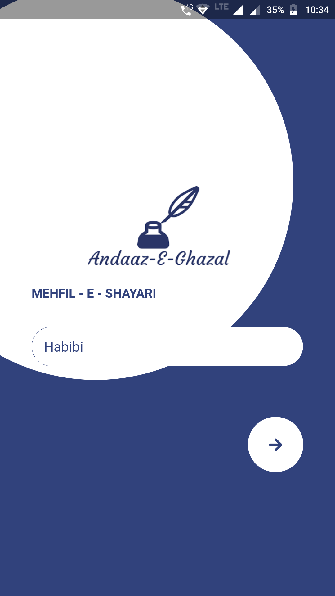
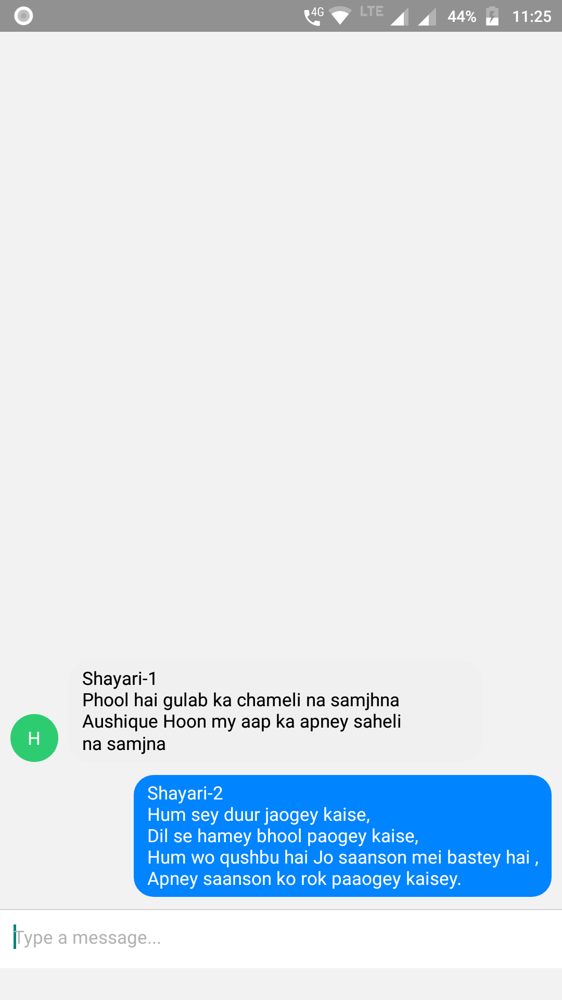

# Basic-Chat-App
## Build with React-native

Basic chat app to get exposure on how to integrate firebase with react app and how the messages are stored in firebase

## About App
App Logo and Title
### SHAYAR   
## The App Looks Like
 
## Description
Drop down Your poetries in our App 

## Find The App
Download the App Here for Android <a href="https://drive.google.com/open?id=1Y_NBR9cW6In0UjoY1VcVHfUzFRC4L71U">App Shayar</a>
